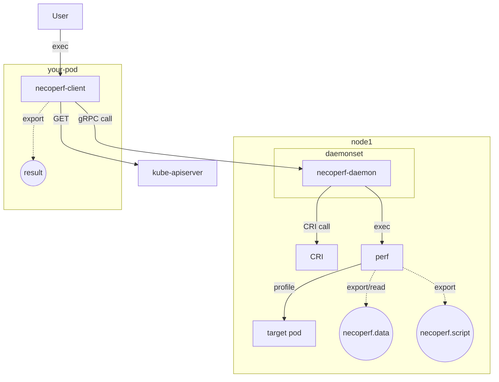

Design Document
===============

## Context and Scope

Currently, it is possible to get profiling using perf for containers running on Kubernetes, but it requires a lot of manual work and strong permissions.
To solve these problems, we provide NecoPerf, a mechanism to get profiling more easily.
NecoPerf can automate many manual operations.

## Goals

- Provides a system for tenant teams to easily run perf command and retrieve profiling results
- NecoPerf users can specify options when running perf command

## Non-goals

- Support for various operating systems (initial implementation is Flatcar only)
- Support TLS (to be implemented in the future)
- Profiling of child processes
  - e.g. container using [tini](https://github.com/krallin/tini)
- Continuous Profiling
- Processing and visualization of acquired profile data, including conversion to [FlameGraph](https://github.com/brendangregg/FlameGraph)

## Proposal

### User Stories

This section describes the actual flow of a situation when a user uses perf command to retrieve profiling.

- The assumption is that the Kubernetes cluster in User stories is used in a multi-tenant environment
  - There is a team managing the cluster and several teams using the cluster
  - The team that uses the cluster is called the tenant team
  - Tenant teams do not have strong privileges

- Tenant teams are aware that there are performance issues with their workloads and want to profile them using perf command to identify bottlenecks.
  However, a lot of things need to be done manually, as the following steps are required to run perf command
  1. Install a perf that is compatible with the kernel version of the host operating system in the container image
  2. Modify the manifest to add a sidecar or ephemeral container with the necessary permissions to run perf
  3. The user of tenant team enters a sidecar or ephemeral container and executes perf command against the target container to retrieve the profile

- The team managing the Kubernetes cluster wants to minimize the permissions granted to the tenant team.
  However, to run perf, the tenant team needs to be able to grant  `CAP_SYS_ADMIN` and `CAP_SYS_PTRACE` permissions to the pod, which violates the principle of least privilege.

NecoPerf does not require manual operations and allows for easy profiling of containers using perf command.

### Constraints

- Restrictions on resolving symbols
  - Debug symbols are required for perf to resolve symbols.
    These debug symbols must be included in the container image to be profiled
- Possible failure to retrieve profiling due to pod status
  - As NecoPerf performs profiling based on the PID, it may not be able to profile successfully if the target process is terminated during profiling

### Risk and Mitigations

- Security Risk
  - It is required for `CAP_SYSLOG` to allow unprivileged users to access kernel addresses (`kptr_restrict`)
  - It is required for `CAP_SYS_ADMIN` and `CAP_SYS_CHROOT` so that perf can resolve addresses to symbols in a container environment
  - Using NecoPerf removes the need to give tenant teams strong permissions like `CAP_SYS_ADMIN` and `CAP_SYS_CHROOT` to run perf
  - It is necessary to enable hostPID for NecoPerf to look up other PID(Process ID) of the host from within the pod
  - NecoPerf converts container id to PID via CRI(Container Runtime Interface) API.
    Therefore, NecoPerf needs to bind the socket of the container runtime, leaving NecoPerf with more functionality than it needs.
    If a read-only CRI API is added in the future, we would like to switch to using that API.
- Performance Risk
  - To prevent tenant teams from running perf for long periods, the NecoPerf validates the values from the user request

## The actual design

The first implementation creates a gRPC server that simply runs perf command on the specified container id and returns the profiling results.
The perf command is used to retrieve profiling and convert the retrieved profiling data.

We also create a command line tool as a client to send requests to the gRPC server.
This command line tool queries the Kubernetes API server based on the pod and container name entered by the user and retrieves the container id.
The command line tool sends a profiling request to the gRPC server based on the retrieved container id.

```console
necoperf-client -n <namespace> <pod-name> -c <container name> -o <output directory>
```

### API

```protobuf
service NecoPerf {
    rpc Record(PerfRecordRequest) returns (PerfRecordResponse);
}

message PerfRecordRequest {
    string container_id = 1;
    int64 interval = 2;
}

message PerfRecordResponse {
    bytes data = 1;
}
```

### System Context Diagram

NecoPerf system overview diagram is shown below.



## Alternatives

This section lists some existing systems and explains why they are not used.

- [IBM/perf-sidecar-injector](https://github.com/IBM/perf-sidecar-injector)
  - perf-sidecar-injector is a mutating webhook that adds a perf container as a sidecar container
  - perf-sidecar-injector requires privileged permission to run the perf container
  - To access the target container from the sidecar, the Pod setting `shareProcessNamespace` must be enabled.
    Enabling `shareProcessNamespace` settings allows other containers in the pod to see environment variables and file systems.
    Some tenant teams may not accept this case.
- [yahoo/kubectl-flame](https://github.com/yahoo/kubectl-flame)
  - kubectl-flame is a kubectl plugin that allows profiling of applications on kubernetes
  - kubectl-flame performs profiling of NodeJS applications by using perf.
  - The command-line arguments of kubectl-flame's perf are hard-coded and the arguments cannot be changed except for the execution time.
<https://github.com/yahoo/kubectl-flame/blob/master/agent/profiler/perf.go#L60>
  - kubectl-flame only supports docker runtime and does not support containerd runtime.
<https://github.com/yahoo/kubectl-flame/issues/51>
- [iovisor/kubectl-trace](https://github.com/iovisor/kubectl-trace)
  - kubectl-trace is a kubectl plugin to schedule bpftrace programmers against Pods on a Kubernetes cluster
  - kubectl-trace only supports tracing against Pods and does not support profiling
- [giannisalinetti/perf-utils](https://github.com/giannisalinetti/perf-utils)
  - The container image of perf-utils installs tools for performance analysis and troubleshooting for immutable systems such as Fedora CoreOS
  - perf-utils does not install a perf compatible with the host kernel version

Explains the problems with the sidecar container method and the Ephemeral Container method.

- The sidecar container method requires the sidecar container to be deployed beforehand.
  If you deploy the sidecar container later, you must tolerate the pod to restart.
- As of Kubernetes 1.26, once an Ephemeral Container is added to a Pod, it cannot be changed or removed
  > Like regular containers, you may not change or remove an ephemeral container after you have added it to a Pod.
  [Ephemeral Container](https://kubernetes.io/docs/concepts/workloads/pods/ephemeral-containers/#understanding-ephemeral-containers)
- The cluster administrator needs to authorise the tenant team to set permissions such as `CAP_SYS_ADMIN` to Pod
- It is difficult for tenant teams to prepare a version of perf command that is compatible with the host OS
